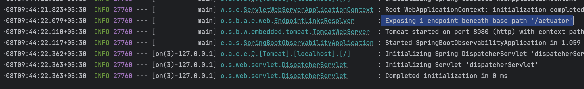
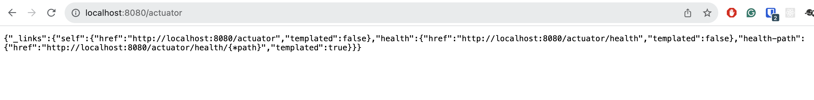
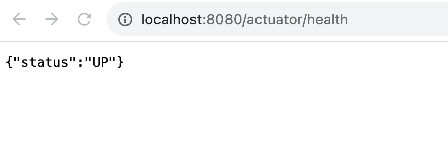
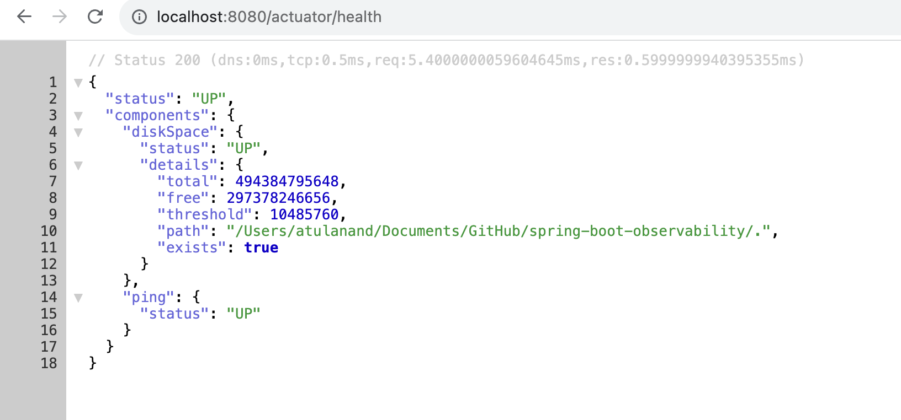
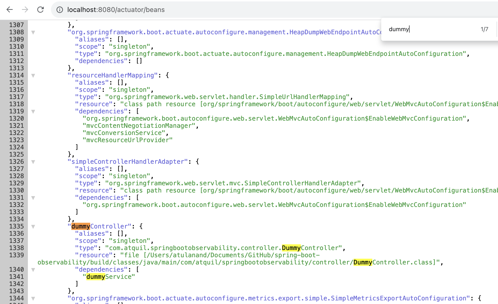
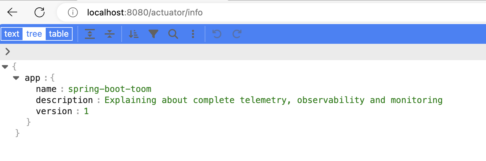
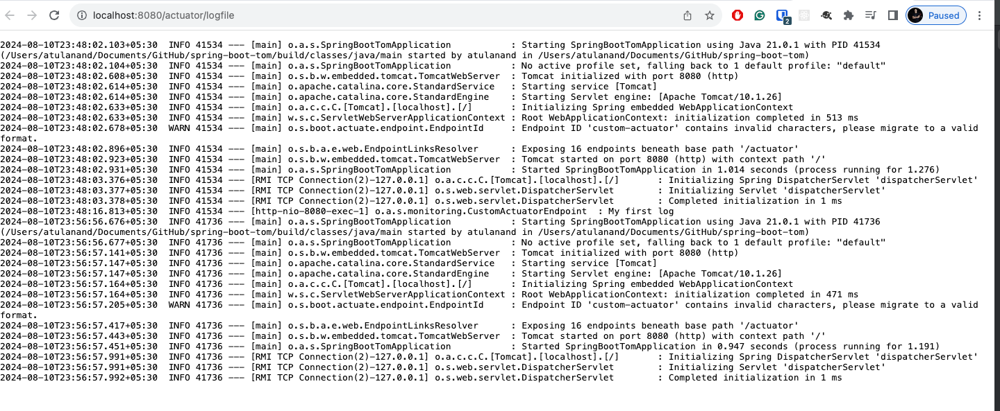

# spring-boot-tom : Monitoring

## Actuator:

+ Actuator is a production grade tool to manage and monitor Spring Boot application using endpoints exposed over HTTP(`management.endpoints.web`) and JMX (`management.endpoints.jmx`)
+ The actuator mainly exposes operational information about the running application — health, metrics, info, dump, env, logfile etc

## Helpful documents

- Spring official guide to implement Actuator for production : https://docs.spring.io/spring-boot/reference/actuator/index.html
- Explanation about Actuator Endpoints: https://docs.spring.io/spring-boot/docs/3.0.x/actuator-api/htmlsingle/#overview


## Part 1 : Project Setup

1. Spring Initializer : https://start.spring.io/
2. Dependency: `web`, `actuator`, `lombok`

   <details>
       <summary>  gradle  </summary>

   ```properties
   implementation 'org.springframework.boot:spring-boot-starter-actuator'
   implementation 'org.springframework.boot:spring-boot-starter-web'
   compileOnly 'org.projectlombok:lombok'
   annotationProcessor 'org.projectlombok:lombok'
   ```
   </details>

   <details>
       <summary>  maven  </summary>

   ```properties
     <dependencies>
       <dependency>
         <groupId>org.springframework.boot</groupId>
         <artifactId>spring-boot-starter-actuator</artifactId>
       </dependency>
       <dependency>
         <groupId>org.springframework.boot</groupId>
         <artifactId>spring-boot-starter-web</artifactId>
       </dependency>
   
       <dependency>
         <groupId>org.projectlombok</groupId>
         <artifactId>lombok</artifactId>
         <optional>true</optional>
       </dependency>
       <dependency>
         <groupId>org.springframework.boot</groupId>
         <artifactId>spring-boot-starter-test</artifactId>
         <scope>test</scope>
       </dependency>
     </dependencies>
   ```
   </details>
3. Have a any json viewer in your browser as extension. 

## Part 2: Actuator Rest API

Document: https://docs.spring.io/spring-boot/api/rest/actuator/index.html
1. Start the Application :

    + By default **/actuator** endpoint is exposed
      

    + Default Endpoint, but it will not give us detailed information
      

2. **Expose** the actuator endpoints

    + Expose Specific endpoints
   ```properties
   management:
     endpoints:
       web:
         exposure:
           include: health, info
   ```
    + Expose All the available endpoints
   ```properties
      management:
        endpoints:
          web:
            exposure:
              include: * 
   ```

3. Core Endpoints : 


+ <details>
   <summary><b>health:</b> <a href="http:localhost:8080/actuator/health">http:localhost:8080/actuator/health</a></summary>
      
   

   Now as the endpoints are exposed, we will have to configure to show the details
   ```properties
   management:
     endpoints:
       web:
         exposure:
           # Enable all the endpoints
           include: '*'
           # Enable specific endpoints
           #include: health
           
     endpoint:
       health:
         show-details: always
   ```
   
   </details>


 + <details>
      <summary><b>bean:</b><a href="http://localhost:8080/actuator/beans">http://localhost:8080/actuator/beans</a></summary>

      Let's add some dummy `controller` and `service` file
      ```java
      @RestController
      @RequestMapping("/api")
      @RequiredArgsConstructor
      public class DummyController {
   
       private final DummyService dummyService;
       @GetMapping("/base")
       public ResponseEntity<String> getBase() {
           return ResponseEntity.ok(dummyService.sayHello());
       }
      }
      ```
      ```java
      @Service
      public class DummyService {
      
          public String sayHello() {return "Hello World!";}
      }
      ```
      
      Result:
      Now let's start the application and go to : "http://localhost:8080/actuator/beans"
      

   </details>


+ <details>
   <summary><b>info:</b> <a href="http://localhost:8080/actuator/info">http://localhost:8080/actuator/info</a></summary>
   As we have not set any information about the application, the info will result in balnk 
   + Test the url 
   
   + Now let's add some information about the applicaiton
   ```properties
   management:
        info:
            env:
                enabled: true
   #Custom information about application
   info:
      app:
         name: spring-boot-toom
         description: Explaining about complete telemetry, observability and monitoring
         version: 1
      author: atquil
   ```
  
   + Now restart the application and test the url 
   
   
   </details>


+ <details>
        <summary><b>log:  </b><a href="http://localhost:8080/actuator/logfile">  http://localhost:8080/actuator/logfile</a> </summary>
      
      ```properties
        logging:
            file:
                name: src/my-logs.log
            level:
                root: info
      ```

    </details>
  

+ <details>
    <summary><b>metrics:</b><a href="http://localhost:8080/actuator/metrics">http://localhost:8080/actuator/metrics</a></summary>
    
    Micrometer dependency has been included
    Interesting one : http://localhost:8080/actuator/metrics/jvm.info
</details>

+ <details>
    <summary><b>audit:</b><a href="http://localhost:8080/actuator/audit">http://localhost:8080/actuator/audit</a></summary>

    Used for monitoring the logging , logout etc. 
</details>


## Custom Base Path

Need to modify the properties file: 
```properties

management:
  endpoints:
    web:
      exposure:
        # Enable specific endpoints
        #include: health
        include: '*'
      #Custom base path instead of /actuator --> /manage
      base-path: /manage
  #Enable health
  endpoint:
    health:
      show-details: always
  # Enable info
  info:
    env:
      enabled: true
```
URL: http://localhost:8080/manage/info 

But let's comment it for ease of understanding.

## Custom Health Endpoint

In your application, sometimes we need to check health status of connected service if it's working fine or not. In those scenerios we can use it 

+ `CloudMonitoring` : Create a class CloudMonitoring implementing **HealthIndicator**
```java
@Component
public class CloudMonitoring implements HealthIndicator {

    private final String GCP_SERVICE = "GCP Service";

    @Override
    public Health health() {

        Map<String, Object> downService = new HashMap<>();

        if(isGCPServiceAvailable()){
            // Single value : withDetail
            return Health.up().withDetail(GCP_SERVICE,"GCP Is up and running").build();
        }else {
            // Multiple values: withDetails
            downService.put(GCP_SERVICE,"GCP Is down");
            downService.put("CONTACT ADMIN","123-1231-12");
            return Health.down().withDetails(downService).build();
        }
    }

    //implement the method to check if GCP and AWS is running
    private boolean isGCPServiceAvailable() {
        // do some logic to test
        return false;
    }
}

```
**Output** : Now run the health endpoint: `http:localhost:8080/actuator/health`

+ <details>
    <summary> GcpService are <b>down</b></summary>
  
    ```text
    {
      "status": "DOWN",
      "components": {
        "cloudMonitoring": {
          "status": "DOWN",
          "details": {
            "CONTACT ADMIN": "123-1231-12",
            "GCP Service": "GCP Is down"
          }
        },
        "diskSpace": {
          "status": "UP",
          "details": {
            "total": 494384795648,
            "free": 293869715456,
            "threshold": 10485760,
            "path": "/Users/atulanand/Documents/GitHub/spring-boot-tom/.",
            "exists": true
          }
        },
        "ping": {
          "status": "UP"
        }
      }
    }
    ```
  </details>
+ <details>
    <summary>GcpService are <b>Up</b></summary>
  
    ```text
    {
      "status": "UP",
      "components": {
        "cloudMonitoring": {
          "status": "UP",
          "details": {
            "GCP Service": "GCP Is up and running"
          }
        },
        "diskSpace": {
          "status": "UP",
          "details": {
            "total": 494384795648,
            "free": 293864648704,
            "threshold": 10485760,
            "path": "/Users/atulanand/Documents/GitHub/spring-boot-tom/.",
            "exists": true
          }
        },
        "ping": {
          "status": "UP"
        }
      }
    }
    ```
    <detials>

# Advanced Topics 

## Add custom Endpoint for Actuator

Sometimes, you may need some specific information like version of specific file, configuraiton of the application, in those scenerios you can use it.

```java
@Component
@Endpoint(id="custom-actuator")
public class CustomActuatorEndpoint {

    @ReadOperation
    public String myCustomActuator() {return "My custom actuator endpoint";}

    @WriteOperation
    public String blockGCP(String key) {
        //Some operation
        return "Gcp has been blocked";
    }

    @DeleteOperation
    public String removeUser(String userId) {
        //Some operation
        return "UserId"+userId+" has been deleted";
    }
    
}
```

Output: 
+ **read operation** : GET http://localhost:8080/actuator/custom-actuator
+ **write operation** : POST http://localhost:8080/actuator/custom-actuator/{12}
+ **delete operation** : DELETE http://localhost:8080/actuator/custom-actuator/{2}

## Adding Custom Grouping of Actuator Endpoints

Custom health indicator helps us in `aggregating` few health indicators that we may need

```properties
  endpoint:
    health:
      show-details: always
      # Custom Health Group
      group:
        custom:
          include: diskSpace, ping
          show-details: always
          show-components: always
```

URL : http://localhost:8080/actuator/health/custom

Output
```text
{
  "status": "UP",
  "components": {
    "diskSpace": {
      "status": "UP",
      "details": {
        "total": 494384795648,
        "free": 293916803072,
        "threshold": 10485760,
        "path": "/Users/atulanand/Documents/GitHub/spring-boot-tom/.",
        "exists": true
      }
    },
    "ping": {
      "status": "UP"
    }
  }
}
```

## Extension for Actuator Endpoints

Sometimes, we need to add some more information for the existing endpoint, we can do that using `EndpointExtension`: `EndpointWebExtension` , `EndpointJMXExtension`

+ Note: Only **One** `Extension` can be made for a particular endpoint. 
+ Create a class called `CustomActuatorWithExtension`

```java
@Component
@EndpointWebExtension(endpoint = InfoEndpoint.class)
@RequiredArgsConstructor
public class CustomActuatorWithExtension {

    private final InfoEndpoint infoEndpoint;

    @ReadOperation
    public WebEndpointResponse<Map> info() {
        Map<String, Object> info = this.infoEndpoint.info();
        Integer status = getStatus(info);
        // Add status to the response body
        info.put("status", status);
        return new WebEndpointResponse<>(info, status);
    }

    private Integer getStatus(Map<String, Object> info) {
        //Some work
        return 200;
    }
}

```

Output:: 

```text
{
  "app": {
    "name": "spring-boot-toom",
    "description": "Explaining about complete telemetry, observability and monitoring",
    "version": "1"
  },
  "author": "atquil",
  "status": 200
}
```
## Security in Actuator

+ Actuator comes with `most endpoints disabled` and `only one available by default is /health`
+ Actuator now shares the security config with regular App security rules, we just need to add the path in `securityFilterChail`/`SecurityWebFilterChain`

```java
@Bean
public SecurityFilterChain securityFilterChain(
  HttpSecurity http) {
    return http.authorizeExchange()
      .pathMatchers("/actuator/**").permitAll()
      .anyExchange().authenticated()
      .and().build();
}
```

+ We can also show details of actuator for authorized users : `when_authorized`
```properties
  endpoint:
    health:
      show-details: always
      # Custom Health Group
      group:
        custom:
          include: diskSpace, ping
          show-details: always
          show-components: when_authorized
    
```

## Interview Questions

1. <details>
    <summary>  What is Actuator ?  </summary>

    + Actuator endpoints let us **monitor and interact** with the application.
    + Base bath : `/actuator/{id}` e.g. /actuator/health
   </details>

2. <details>
       <summary> Can we have custom base path for actuator? If so how?  </summary>

      ```properties
      management.endpoints.web.base-path=/manage
      ```
       Using the above will change the base path to `/manage/{id}`
      </details>

3. <details>
    <summary>  How Actuator Endpoints are made available ?  </summary>

   We need to **enable and expose** them(to make them remotely accessible) over HTTP or JMX.

   ```properties
         management:
           endpoints:
             web:
               exposure:
                 # Expose all the endpoints
                 include: *
                # Expose only specific 
                # include: health 
   ```
   </details>
4. <details>
    <summary>How you can add custom method to <b>health</b> endpoint</summary>
    
    + `implementing HealthIndicator `
    + `returning Health.up().withDetails(..).build()`
    </details>

5. <details>
    <summary> How to add custom <b> endpoints</b> to actuator</summary>
    
    + `@Endpoint(id="<name_of_endpoint")` to class
    + Endpoint type: `@ReadOperation`, `@WriteOperation`, `@DeleteOperation`
   </details>

6. <details>
    <summary> How to see the console logs using Actuators</summary>
    
   ```properties

    logging:
        file:
            name: src/my-logs.log
        level:
            root: info 
    
    management:
        endpoints:
            web:
                exposure:
                    include: info, health, logfile, loggers, env        
    
    ```
    + endpoint : http://localhost:8080/actuator/logfile
   
    output: 

    
    </details>
7. How to add security for Actuators : Using application security: `SecurityFilterChain`
8. Can we modify existing Actuator Endpoints: Yes using `EndpointExtension`, but can be done `only once for each endpoint`
9. Can we add custom grouping in actuator : Yes, using **group**

